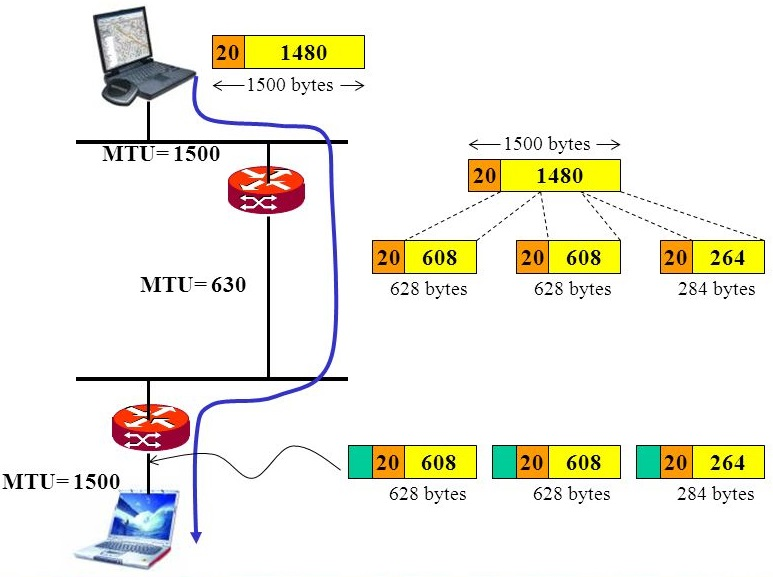
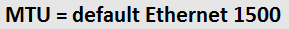
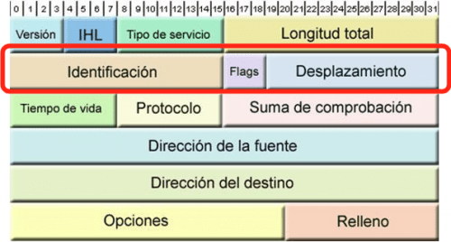
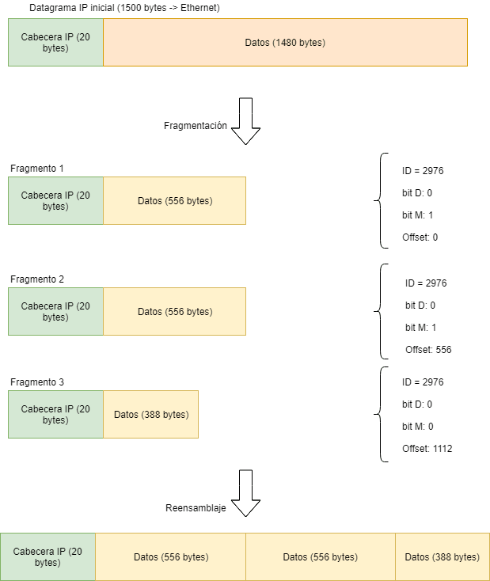
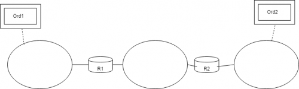
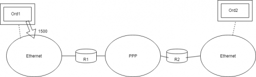
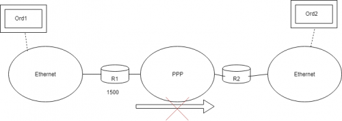
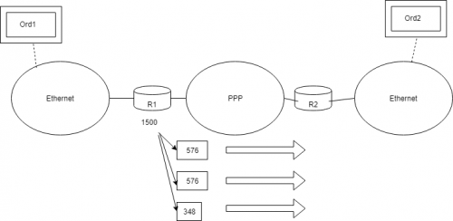
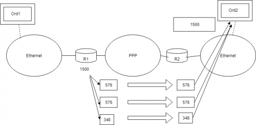

layout: default
title: Fragmentación
nav_order: 31
permalink: /fragmentacion
---
##### **Autores: José Manuel Hernández Castro**
{: .no_toc}

##### **Fecha de creación: Junio 18, 2020**
{: .no_toc }

##### **Revisiones: Sin revisión** 
{: .no_toc }

##### **Fecha de revisión: Sin fecha de revisión** 
{: .no_toc }

# Fragmentación
{: .no_toc }

#### Contenido:
{: .no_toc }

1. ¿Qué es frangmentación en Redes?
2. ¿Qué es el MTU Ethernet?
3. Campos Importantes de un Datagrama Fragmentado
4. Proceso de Fragmentación
5. Pros y Contras de la Fragmentación
{:toc}

---

## ¿Qué es fragmentación?
La fragmentación de paquetes IP es un mecanismo que permite la separación de un datagrama IP en diversos bloques de datos llamados "fragmentos" si su tamaño excede la Unidad Máxima de Transferencia Ethernet (MTU Ethernet). Debido a esto, los campos:

+ Longitud
+ Tamaño de la cabecera
+ Checksum
+ Opciones

de la cabecera IP que no participan activamente se verán afectados y por consecuente, cambiarán de valor.

## ¿Qué es el MTU Ethernet?
El MTU Ethernet es el que indica el máximo de bytes que se pueden encapsular en una trama, es decir, la longitud máxima del datagrama.

## Campos Importantes de un Datagrama Fragmentado

+ **Identification (16 bits):**
  - Número que nos permite identificar a qué datagrama pertenece un fragmento. El host que realiza la fragmentación del datagrama a enviarse, se ocupa de asignar el valor. Este valor sale de un contador que se incrementa en 1 cada vez que se genera un nuevo datagrama.

+ **Flags (3 bits):**
  - Tienen el formato 0DM en donde el 0, no se utiliza.

    * **D (don’t fragment):** Si se encuentra a 1 quiere decir que el datagrama no se puede fragmentar o no es necesario fragmentarlo.
    * **M (more fragments):** Si se encuentra a 1 quiere decir que se ha fragmetnado y todos los fragmentos consecuentes de este datagrama llevan un 1 en este campo excepto el último.

+ **Fragment Offset (13 bits):**
  - Indica la posición del primer byte del fragmento en el datagrama original (el valor inicial es “0”).

## Proceso de Fragmentación

+ **Paso #0:** El **Host 1** (Ord1) quiere enviar un mensaje al **Host 2** (Ord2); para que esto sea posible, debe que pasar por 3 redes y 2 routers en total.

+ **Paso #1:** El **Host 1** se encuentra en una red local, encapsula un datagrama en una trama con un MTU de 1500 bytes. Al ser esto posible, simplemente será transmitido por nuestra intranet hasta el router sin ningun problema.

+ **Paso #2:**
  - **R1** recibe la trama y lo desencapsula para quedarse con el datagrama.
  - **R1** lee  el header IP y mueve el datagrama a la interfaz de salida que le indica su tabla de enrutamiento.
  - **R1** quiere crear la trama para enviarla pero este nota que el MTU de su tarjeta PPP (Point-to-Point Protocol) es menor que el tamaño del datagrama (576 < 1500) y por lo tanto no puede enviarlo, aún.

+ **Paso #3:**
  - **R1** debe fragmentar el datagrama en "pedazos" más pequeños (576 + 576 + 348) para que pueda ser encapsulado.
  - **R1** retransmite cada fragmento por separado.

+ **Paso #4:** Los fragmentos llegan a **R2** y como el MTU de su tarjeta de red Ethernet es mayor a la de los fragmentos, estos siguen su camino hasta el **Host 2** (Ord2). El “reensamblaje” de estos fragmentos se realiza en el **Host 2** (en Ord2), además de que pueden llegar desordenados o no llegar todos. Por otro lado, es necesario diferenciar estos datagramas del resto y para ello se utilizan los campos que mencionamos en el punto anterior.

## Pros y Contras de la Fragmentación

+ **Pros:**
  - Permite que un datagrama viaje por distintas redes y topologías de red independientemente de que protocolos ó tarjetas de red se estén utilizando.

+ **Contras:**
  - Si se pierde un fragmento en el proceso de envío, se deben de retransmitir nuevamente todos los fragmentos del datagrama original.
  - La fragmentación puede afectar negativamente al flujo de datos. Por eso se intenta usar lo menos posible.